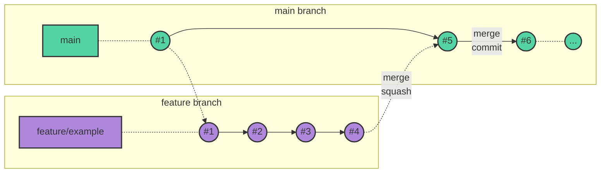

# Contributing to this repository

First off, thanks for taking the time to contribute! The following is a set of guidelines for contributing to CLADE project. We encourage everyone to follow them with their best judgement.

## Table of contents

1) [Issues](#issues)
2) [Branching Strategy](#branching-strategy)
   - [Workflow](#workflow)
   - [Supporting branches](#supporting-branches)
3) [Commits](#commits)
4) [Merge requests](#merge-requests)
   - [Creating a PR](#creating-a-pr)
   - [Merging a PR](#merging-a-pr)

## Issues

With issues you can report bugs, issues or suggestions, to improve the project. A set of rules have also been established in the issues, shown below:

- **Before opening an issue, check that the topic is not being treated in another**. Do a bit of research
in the open and closed issues to try not to repeat topics. When searching, **good labeling** can be key.
- **Try to keep the title simple and concise**. So that at first view you can get an idea of ​​the subject.
- **Make an effort to try to explain the reason for the issue in the description**. The description must contain all the important information associated with that topic.
- **Assign and create tags for the issue**. It is recommended to tag the issue with tags that indicate the type of changes (feature, enhancement, bug...), technologies, topics, etc, by the issue creator or by those responsible for the repository.
- **An issue must be linked to the PR of the branch that solves it**. Using `Closes #number` or `Fix #number` with a comment or in the description itself as to maintain traceability. [Another ways](https://docs.github.com/en/issues/tracking-your-work-with-issues/linking-a-pull-request-to-an-issue).
- **Associate similar or dependent issues in the description or in comments**. Both by the creator and collaborators, using `#issue-number`.
- **Issues are closed when they have been solved/invalidated or repeated**. They can be closed by the creator or by the members of the repository when the issue has **been resolved**, after discussing it and, if necessary, applying changes.

## Branching Strategy
One of the main features of the [Git](https://git-scm.com/) version controller is branching. Branching is a really cheap and extremely useful operation, if used correctly. Therefore, it is necessary to define an ordered and controlled way of using this functionality.

### Workflow

The workflow used in this project is [Trunk-based development](https://trunkbaseddevelopment.com/). In this section, we explain what a developer's workflow would be like to contribute to this project step by step:

1. Creation of an issue to expose the task to be performed (see section Issues).
2. Creating a branch, with the correct name (see the Branches section).
3. Making the changes and uploading the branch to the remote repository.
4. Creation of the Pull Request (see section Pull requests).
5. Peer reviewing by the PR reviewer.
6. Once the reviewer approves the PR, close, merge (squash) and delete the branch with the changes.

The following [mermaid diagram](https://mermaid.js.org/) show a graphical overview of this workflow:



### Supporting branches
Support branches are temporary branches created to separate discrete developments that need to be reviewed before being integrated into the main development stream. They provide security to the main development, as not any change can be integrated. Also, they provide a closed work environment for one or several collaborators who are working on the same development, avoiding conflicts and unwanted changes being mixed with other developments.

For clarity, this repository follows a supporting branch naming convention.
Branch names are composed by 2 fields separated by a slash. The first field is the type of changes, and the value must be one of the following:

- **`enhancement/`**: It is used to upgrade previous, existing functionalities.
- **`feature/`**: It is used to incorporate new functionalities.
- **`docs/`**: It is used to incorporate or upgrade documentation.
- **`bugfix/`**: It is used to correct errors found in the project.

All previous branches must be created from the **`main`** branch.

The second field, after the slash, must follow the following convention:

- **NUMBER prefix**. Branches associated to an GitHub issue (issue #NUMBER) must follow this prefix.
- (*Optional*) **Name, after the prefix, descriptive and informative about the task**. Character `-` must be used as a separator.

Examples:
```
    bugfix/3
    bugfix/3-fix-ssl-X509-error
```

## Commits
Commits are the most basic element of the [Git](https://git-scm.com/)  version controller. A correct use of commits facilitates the maintenance and review of repositories.

To achieve this goal, a series of standards and good practices have been established:
- **Commits must be [signed](https://docs.github.com/es/authentication/managing-commit-signature-verification/signing-commits)** to be able to verify that the confirmations really come from a trusted source.
- **Messages must be descriptive**. They have to reflect the theme of the changes that have been included in the commit. You can read this wonderful [post](https://cbea.ms/git-commit/) that explains how to write commit messages correctly in Git.
- **[Atomic](https://www.aleksandrhovhannisyan.com/blog/atomic-git-commits/) commits**. This means that each commit contains the changes necessary to achieve an objective, without mixing them with changes related to another purpose. It makes it much easier to review and, if necessary, revert them.
- **Prevent unwanted line endings**. Configure Git to prevent different line breaks added by each OS with this guide [Configuring Git to handle line endings](https://docs.github.com/en/github/using-git/configuring-git-to-handle-line-endings).
- **Using [conventional commits](https://www.conventionalcommits.org/en/v1.0.0/) is recommended**.

## Merge requests
Merge requests let you tell others about changes you have pushed to a branch in our repository. They are a dedicated forum for discussing the implementation of the proposed features or bugfixes between committer and reviewer(s). This is an essential mechanism to improve the quality of our codebase.

This section will indicate how to create PRs and when to merge them.

### Creating a PR

There are five points that need to be addressed about the creation of a PR:
- **Title**: should be quite **descriptive** as once the merge is performed, it will remain as a summary of the developed work in the form of a merge commit message.

- **Description**.
  - It should contain the **changes** to be made to the branch.
  - It must contain a **link** to the **related issue** (use `#issue-number`) as to maintain traceability.
  - (*Optional*) It can help a lot to work in an ordered manner. For instance, it could be helpful for reviewers if a **list of checkpoints** was created in the description, with the tasks or objectives that are going to be carried out. Then we may check them out after the last commit that completes the corresponding task, even though they may be later refined.
- **Destination branch**: the **`main`** branch.
- **Labels**. Labels help to classify similar merge requests. We recommend using at least the type from the related branch, but you are free to create and use others as well: take into account the labels of the related issue.
- **Reviewer**. Until the PR is ready for review it is best not to assign anyone. This avoids sending excessive notifications to the other person.


### Merging a PR

- Whoever pushes the changes, merges the changes.
- Use [_squash merge_](https://graphite.dev/guides/git-merge-squash) to avoid cluttering the `main` branch with excessive commits.

