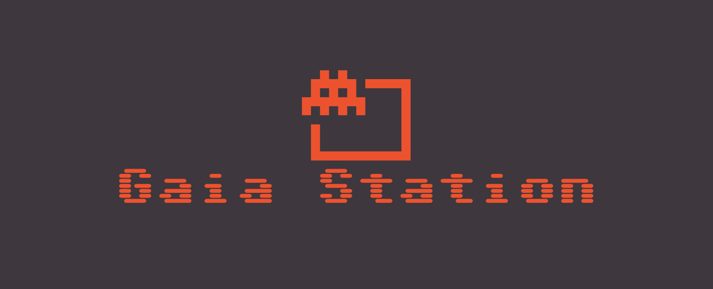

<!-- Improved compatibility of back to top link: See: https://github.com/othneildrew/Best-README-Template/pull/73 -->
<a name="readme-top"></a>
<!--
This README is based on the Best-README-Template by othneildrew. (https://github.com/othneildrew/Best-README-Template/)
-->


<!-- PROJECT SHIELDS -->
<!--
*** I'm using markdown "reference style" links for readability.
*** Reference links are enclosed in brackets [ ] instead of parentheses ( ).
*** See the bottom of this document for the declaration of the reference variables
*** for contributors-url, forks-url, etc. This is an optional, concise syntax you may use.
*** https://www.markdownguide.org/basic-syntax/#reference-style-links
-->
[![Contributors][contributors-shield]][contributors-url]
[![Forks][forks-shield]][forks-url]
[![Stargazers][stars-shield]][stars-url]
[![Issues][issues-shield]][issues-url]
[![MIT License][license-shield]][license-url]


<!-- PROJECT LOGO -->
<br />
<div align="center">
  <a href="https://github.com/manucorujo/CIIE-GaiaStation">
    
  </a>


<h3 align="center">Gaia Station</h3>

  <p align="center">
    2D game project developed for the subject "Contornos Inmersivos, Interactivos y de Entretenimiento (CIIE)"  of the Computer Science degree of the Universidade Da Coruña (UDC).
    <br />
    <a href="https://github.com/manucorujo/CIIE-GaiaStation"><strong>Explore the docs »</strong></a>
    <br />
    <br />
    <a href="https://github.com/manucorujo/CIIE-GaiaStation">View Demo</a>
    ·
    <a href="https://github.com/manucorujo/CIIE-GaiaStation/issues">Report Bug</a>
    ·
    <a href="https://github.com/manucorujo/CIIE-GaiaStation/issues">Request Feature</a>
  </p>
</div>


<!-- TABLE OF CONTENTS -->
<details>
  <summary>Table of Contents</summary>
  <ol>
    <li>
      <a href="#about-the-project">About The Project</a>
      <ul>
        <li><a href="#built-with">Built With</a></li>
      </ul>
    </li>
    <li>
      <a href="#getting-started">Getting Started</a>
      <ul>
        <li><a href="#prerequisites">Prerequisites</a></li>
        <li><a href="#installation">Installation</a></li>
      </ul>
    </li>
    <li><a href="#usage">Usage</a></li>
    <li><a href="#roadmap">Roadmap</a></li>
    <li><a href="#contributing">Contributing</a></li>
    <li><a href="#license">License</a></li>
  </ol>
</details>


<!-- ABOUT THE PROJECT -->
## About The Project
<div align=center>
  <a href="https://github.com/manucorujo/CIIE-GaiaStation">
    
  </a>
</div>


### Built With

[![Pygame][Pygame]][Pygame-url]


<p align="right">(<a href="#readme-top">back to top</a>)</p>


<!-- GETTING STARTED -->
## Getting Started

To get a local copy up and running follow these simple example steps.

### Prerequisites

This is an example of how to list things you need to use the software and how to install them.

* Python
  ```sh
  apt install python
  ```

* Pip
  ```sh
  apt install python-pip
  ```

### Installation

1. Clone the repo
   ```sh
   git clone https://github.com/manucorujo/CIIE-GaiaStation.git
   ```
2. Install dependencies
   ```sh
   pip install -r requirements.txt
   ```

<p align="right">(<a href="#readme-top">back to top</a>)</p>


<!-- USAGE EXAMPLES -->
## Usage

To run the game, navigate to the `src/` directory:
```sh
cd src/
```

 and execute the Python file `main.py`:
```sh
python main.py
```

It is worth noting that to facilitate testing of different levels, developers can advance to the next level by pressing the letter E. As explained in the corresponding issue, this functionality should only be included in debug mode and removed from normal gameplay.


<p align="right">(<a href="#readme-top">back to top</a>)</p>


<!-- ROADMAP -->
## Roadmap

See the [open issues](https://github.com/manucorujo/CIIE-GaiaStation/issues) for a full list of proposed features (and known issues).

<p align="right">(<a href="#readme-top">back to top</a>)</p>


<!-- CONTRIBUTING -->
## Contributing

Would you like to contribute? Great! Then, please refer to the [CONTRIBUTING.md](https://github.com/manucorujo/CIIE-GaiaStation/blob/main/.github/CONTRIBUTING.md) file for instructions.

<p align="right">(<a href="#readme-top">back to top</a>)</p>


<!-- LICENSE -->
## License

Distributed under the MIT License. See [LICENSE](https://github.com/manucorujo/CIIE-GaiaStation/blob/main/LICENSE) file for more information.

<p align="right">(<a href="#readme-top">back to top</a>)</p>


<!-- CONTACT -->
<!--
## Contact

Your Name - [@twitter_handle](https://twitter.com/twitter_handle) - email@email_client.com

Project Link: [https://github.com/manucorujo/CIIE-GaiaStation](https://github.com/manucorujo/CIIE-GaiaStation)

<p align="right">(<a href="#readme-top">back to top</a>)</p>
-->


<!-- ACKNOWLEDGMENTS -->
<!--
## Acknowledgments

* []()
* []()
* []()

<p align="right">(<a href="#readme-top">back to top</a>)</p>
-->


<!-- MARKDOWN LINKS & IMAGES -->
<!-- https://www.markdownguide.org/basic-syntax/#reference-style-links -->
[contributors-shield]: https://img.shields.io/github/contributors/manucorujo/CIIE-GaiaStation.svg?style=for-the-badge
[contributors-url]: https://github.com/manucorujo/CIIE-GaiaStation/graphs/contributors
[forks-shield]: https://img.shields.io/github/forks/manucorujo/CIIE-GaiaStation.svg?style=for-the-badge
[forks-url]: https://github.com/manucorujo/CIIE-GaiaStation/network/members
[stars-shield]: https://img.shields.io/github/stars/manucorujo/CIIE-GaiaStation.svg?style=for-the-badge
[stars-url]: https://github.com/manucorujo/CIIE-GaiaStation/stargazers
[issues-shield]: https://img.shields.io/github/issues/manucorujo/CIIE-GaiaStation.svg?style=for-the-badge
[issues-url]: https://github.com/manucorujo/CIIE-GaiaStation/issues
[license-shield]: https://img.shields.io/github/license/manucorujo/CIIE-GaiaStation.svg?style=for-the-badge
[license-url]: https://github.com/manucorujo/CIIE-GaiaStation/blob/master/LICENSE.txt
[linkedin-shield]: https://img.shields.io/badge/-LinkedIn-black.svg?style=for-the-badge&logo=linkedin&colorB=555


[Python]: https://img.shields.io/badge/Python-3776AB?style=for-the-badge&logo=python&logoColor=white
[Python-url]: https://www.python.org/


[Pygame-url]: https://www.pygame.org/
[Pygame]: https://www.pygame.org/docs/_static/pygame_tiny.png
